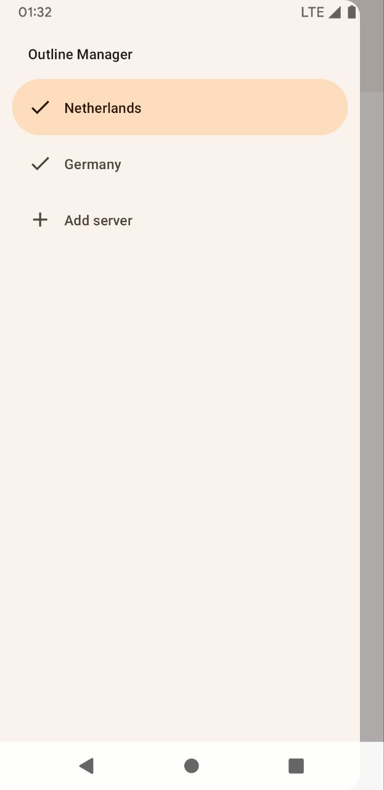

# Outline Manager for Android

This application uses Outline Server Management API to manage Outline servers. You can find more
information on https://getoutline.org.

<picture>
  <source width="300" media="(prefers-color-scheme: dark)" srcset="app/src/main/play/listings/en-US/graphics/phone-screenshots/1.jpg">
  
</picture>

<picture>
  <source width="300" media="(prefers-color-scheme: dark)" srcset="app/src/main/play/listings/en-US/graphics/phone-screenshots/2.jpg">
  
</picture>

